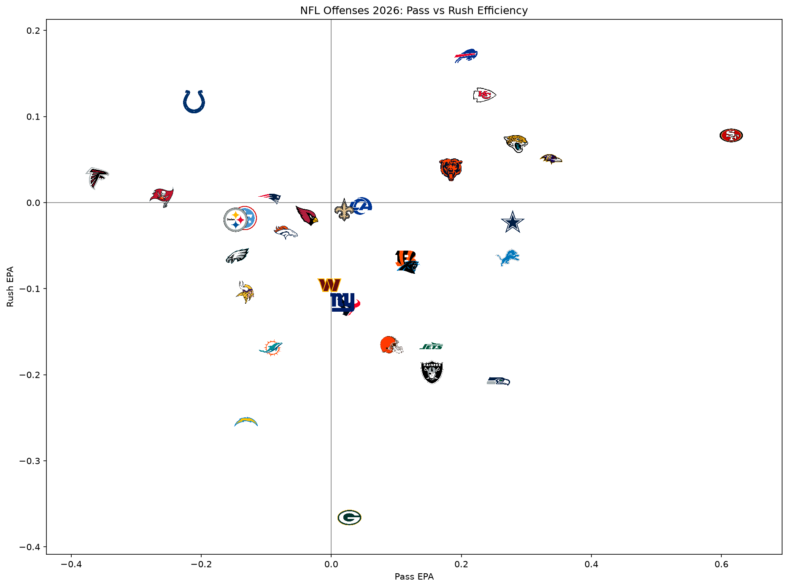

# NFL Offensive Efficiency Tracker

Ranks every NFL offense by efficiency using EPA per play, success rate, and explosive play rate, with separate pass and rush splits. Data covers the 2026 regular season through the latest week.

## Key finding
San Francisco leads the league at 0.357 EPA per play, driven by a pass offense (0.615 EPA) far ahead of every other team.

## Files
- `nfl_offense_tracker.py`: pulls data and builds the rankings
- `offense_season.csv` / `offense_weekly.csv`: season and week-by-week results
- `plot_logos.py`: draws the pass vs rush chart with team logos

## Tools
Python, pandas, matplotlib, Power BI
